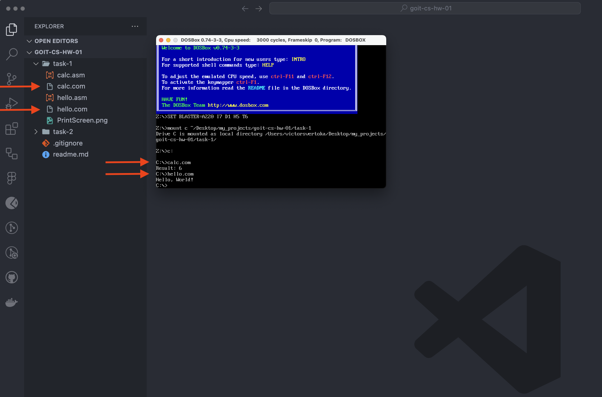
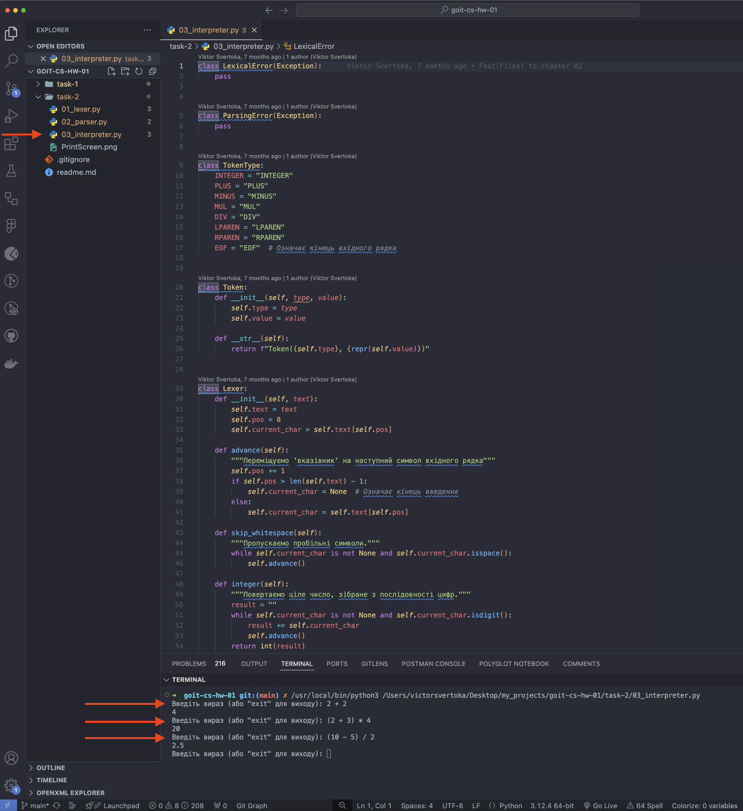

# Домашнє завдання до модуля “Архітектура комп'ютерів”

Вітаємо в першому домашньому завданні! 🙂

Сьогодні ви будете модифікувати програму на асемблері. Ви отримаєте розуміння асемблеру, його основних концепцій, роботи та мети застосування. Також ви допрацюєте інтерпретатор для того, щоб докладніше зрозуміти основні концепції синтаксичного та лексичного аналізу.

### У процесі виконання ви:

- Навчитеся модифікувати існуючий код на асемблері для вирішення нових обчислювальних завдань.
- Закріпите знання роботи з регістрами процесора.
- Зрозумієте, як програма на Асемблері взаємодіє з апаратним забезпеченням та виконує вказані обчислення.
- Навчитеся модифікувати лексер та парсер для розпізнавання та обробки нових типів токенів та операцій.
- Навчитеся оновлювати інтерпретатор для взаємодії з різними операціями та правильної обробки виразів у дужках.

У вас все вийде! 💪🏼

#### Підготовка та завантаження домашнього завдання

1. Створіть публічний репозиторій `goit-cs-hw-01`.

2. Виконайте завдання та відправте його у свій репозиторій.

> [!NOTE]
>
> Для завдання 2 не потрібно окремі файли для лексера, парсера та інтепретатора — вистачить одного об'єднаного файлу.

3. Завантажте робочі файли на свій комп’ютер та прикріпіть їх у `LMS` у форматі `zip`. Назва архіву повинна бути у форматі `ДЗ1_ПІБ`.

4. Прикріпіть посилання на репозиторій `goit-cs-hw-01` та відправте на перевірку.

#### Формат оцінювання

- Залік/незалік

#### Формат здачі

- Прикріплені файли репозиторію у форматі `zip` з назвою `ДЗ1_ПІБ`.
- Посилання на репозиторій.

> [!IMPORTANT]
>
> 💡 ВАЖЛИВО
>
> Перегляньте Інструкцію щодо завантаження робочого файлу з репозиторію на Github

## Технiчний опис завдань

Домашнє завдання складається з двох незалежних завдань.

### Завдання 1

Розробіть програму на асемблері, яка виконує обчислення арифметичного виразу `b - c + a`.

Використовуйте як основу приклад програми для обчислення `a + b - c`, представлений у конспекті (посилання на папку репозиторію до конспекту), але з необхідними модифікаціями для вирішення цього завдання.

#### Покрокова інструкція

1. Вивчіть код програми, що обчислює `a + b - c`, наведений у конспекті.

2. Модифікуйте програму так, щоб вона виконувала обчислення за формулою `b - c + a`.

3. Після внесення змін у код скомпілюйте та запустіть програму, щоб перевірити, чи коректно вона обчислює вираз `b - c + a`.

4. Ваша програма повинна виводити результат обчислення на екран.

5. Після запуску програми у DOSBox зробіть скріншот вікна DOSBox із відображеним результатом виконання вашої програми.

#### Критерії прийняття

- Програма коректно обчислює вираз `b - c + a` та виводить результат обчислення на екран.

- Зроблено та прикріплено скріншот вікна DOSBox із відображеним результатом виконання програми.

> [!TIP]
>
> Критерії прийняття домашнього завдання є обов’язковою умовою розгляду домашнього завдання ментором. Якщо якийсь з критеріїв не виконано, ДЗ відправляється ментором на доопрацювання без оцінювання.
> Якщо вам “тільки уточнити”😉 або ви “застопорилися” на якомусь з етапів виконання— звертайтеся до ментора у Slack)

### Завдання 2

У вас є початковий код інтерпретатора з конспекту, який вміє обробляти арифметичні вирази, включаючи операції додавання та віднімання (посилання на папку репозиторію до конспекту).

Ваше завдання полягає в розширенні цього інтерпретатора таким чином, щоб він також підтримував операції множення та ділення, а також коректно обробляв вирази, що містять дужки.

#### Покрокова інструкція

#### 1. Розширте лексер `Lexer`

- Додайте нові типи токенів для операцій множення `MUL`, ділення `DIV` та дужок, які відкривають `LPAREN` та закривають RPAREN частину арифметичного виразу.
- Модифікуйте метод `get_next_token` класу `Lexer` так, щоб він розпізнавав ці нові символи.

#### 2. Модифікуйте парсер `Parser`

- Додайте метод `factor` для обробки чисел та виразів у дужках.
- Змініть метод `term`, щоб він включав обробку множення та ділення.
- Внесіть відповідні зміни в метод `expr` для підтримки нової ієрархії операцій.

#### 3. Оновіть Інтерпретатор `Interpreter`

- Доповніть метод `visit_BinOp` у класі `Interpreter` так, щоб він міг обробляти операції множення та ділення.

#### 4. Тестування

- Перевірте коректність роботи інтерпретатора на різних арифметичних виразах, включаючи вирази з дужками, наприклад `(2 + 3) * 4` повинно дати результат `20`.

#### Критерії прийняття

- Додано нові типи токенів для операцій множення `MUL`, ділення `DIV` та дужок.
- Модифіковано метод `get_next_token`, щоб він розпізнавав нові символи.
- Модифіковано парсер `Parser` .
- Оновлено Інтерпретатор так, щоб він підтримував операції множення та ділення, обробляв вирази з дужками.
- Інтерпретатор працює коректно.

### Результат виконаного завдання № 1

### Результат виконаного завдання № 2

